<!--
*** Thanks for checking out this README Template. If you have a suggestion that would
*** make this better, please fork the tinyml-mapping-backlight and create a pull request or simply open
*** an issue with the tag "suggest".
*** Thanks again! Now go create something AMAZING! :D
***
***
***
*** To avoid retyping too much info. Do a search and replace for the following:
*** fullmakeralchemist, tinyml-mapping-backlight, twitter_handle
-->

<!--#     The TensorFlow Microcontroller Challenge    -->
   <h1>Hands Spelling Recognition with Object Detection</h1>

<!-- PROJECT LOGO -->

<br />
<p align="center">
<!--
  <a href="https://github.com/fullmakeralchemist/tinyml-mapping-backlight">
    
  </a>
  -->
  <br />
  

  
  
  
  
  <a href="https://www.linkedin.com/in/padrondata/">
    
  </a>
  <!--
  <a href="https://twitter.com/makeralchemist/">
    
  </a>
  -->
  
  <!-- <h3 align="center">Tiny ML in Mapping Dance, Visual Arts and interactive museums</h3>-->
  <p align="center">
    rPor favor revisen los dos links de streamlit uno es el que pude mejorar en la semana extra---->
    <br />
    <a href="https://objectdetectionwebcam.streamlit.app/"><strong>Proyecto deteccion de objetos en imagenes»</strong></a>
    <br />
    <br />
    <a href="https://experiments.withgoogle.com/mapping-dance"><strong>Proyecto deteccion de objetos en video y webcam»</strong></a>
    <br />
  </p>
  <!--
  <p align="center">
  <a href="https://experiments.withgoogle.com/mapping-dance">
    
  </a>
  </p>
  -->
  <br />
</p>
<br />

<!-- TABLE OF CONTENTS -->
## Table of Contents

* [About the Project](#about-the-project)
  * [Motivation](#motivation)
  * [Built With](#built-with)
* [Getting Started](#getting-started)
  * [Prerequisites](#prerequisites)
  * [Installation](#installation)
* [Introduction and Setup for Roboflow](#introduction-and-setup-for-roboflow)
  * [Demo of the Object Detection App](#demo-of-the-object-detection-app)
  * [Object Detection](#object-detection)
  * [What is YOLOv8?](#what-is-yolov8)
  * [Why Should I Use YOLOv8?](#why-should-i-use-yolov8)
  * [Why Streamlit is a Good Choice for Building a ML App](#why-streamlit-is-a-good-choice-for-building-a-ml-app)
  * [Project Setup: Installing Dependencies and Creating Required Files and Directories](#project-setup-installing-dependencies-and-creating-required-files-and-directories)
  * [Creating Virtual Environment](#creating-virtual-environment)
  * [Create a project with Roboflow](#create-a-project-with-roboflow)
  * [Upload your images](#upload-your-images)
* [Train YOLOv8 on a custom dataset](#train-yolov8-on-a-custom-dataset)
  * [Deploy model on Roboflow](#deploy-model-on-roboflow)
* [Creating a Streamlit WebApp for Image Object Detection with a Roboflow model](#creating-a-streamlit-webapp-for-image-object-detection-with-a-roboflow-model)
  * [Create a Uploading an Image On Streamlit WebApp](#create-a-uploading-an-image-on-streamlit-webapp)
* [Enhancing Active Learning: Uploading Data to Roboflow from Windows or Google Colab using the API](#enhancing-active-learning-uploading-data-to-roboflow-from-windows-or-google-colab-using-the-api)
  * [Upload images to Roboflow using the API and Python](#upload-images-to-roboflow-using-the-api-and-python)
* [Enhancing Active Learning: Uploading Data to Roboflow from Raspberry Pi using the API](#enhancing-active-learning-uploading-data-to-roboflow-from-raspberry-pi-using-the-api)
  * [Upload images to Roboflow using the API and Python (Thonny IDE in Raspberry Pi)](#upload-images-to-roboflow-using-the-api-and-python-thonny-ide-in-raspberry-pi)
* [How to Deploy a Roboflow (YOLOv8) Model to a Raspberry Pi](#how-to-deploy-a-roboflow-yolov8-model-to-a-raspberry-pi)
  * [Download the Roboflow Docker Container to the Pi](#download-the-roboflow-docker-container-to-the-pi)
  * [Run Inference](#run-inference)
* [Challenges I ran into and What I learned](#challenges-i-ran-into-and-what-i-learned)
* [Observations about the project](#observations-about-the-project)
* [Accomplishments that I'm proud of](#accomplishments-that-im-proud-of)
* [What's next for Hands Spelling Recognition with Object detection](#whats-next-for-hands-spelling-recognition-with-object-detection)
* [License](#license)
* [Contact](#contact)

<!-- ABOUT THE PROJECT -->
## About The Project

<!-- [](https://www.youtube.com/watch?v=3YUVTDTo-Zk) -->

The goal of this project is to detect and translate Sign Language (ASL) fingerspelling into text. You will create a model trained on the images dataset, custom created specifically to try different approaches. This may help move sign language recognition forward, making AI more accessible for the Deaf and Hard of Hearing community.

This project makes use of a machine learning platform that simplifies the process capable of identifying associated gesture recognition through images. This allows the user to work with it on custom needs.

### Motivation

Some facts:

Voice-enabled assistants open the world of useful and sometimes life-changing features of modern devices. These revolutionary AI solutions include automated speech recognition (ASR) and machine translation. **Unfortunately, these technologies are often not accessible to the more than 70 million Deaf people around the world who use sign language to communicate, nor to the 1.5+ billion people affected by hearing loss globally.**

##### Technology can be an element for good, but only when everyone is included.

But sign language recognition AI for text entry lags far behind voice-to-text or even gesture-based typing, as robust datasets didn't previously exist.

Technology that understands sign language fits squarely with AI solutions and makes it universally accessible and useful. AI principles also support this idea and encourage projects that empower people, widely benefit current and future generations, and work for the common good. This project can be scaled, and support individual user experience needs while interacting with technology.

### Built With

With a lot of love 💖, motivation to help others 💪🏼 and [Python](https://www.python.org/) 🐍, using:

* [Roboflow](https://app.roboflow.com/)
* [Google Colab](https://colab.research.google.com/)  (with its wonderful GPUs)
* Laptop with webcam
* [Streamlit](https://streamlit.io/)


<!-- GETTING STARTED -->
## Getting Started

Object detection is a groundbreaking computer vision task that has a ton of applications across various industries. It goes beyond traditional image classification, where a model assigns a single label to an entire image, to identify and locate multiple objects within an image, often accompanied by bounding boxes outlining their positions.

When working on custom models for object detection or other machine learning tasks, one of the challenges that researchers and developers may encounter is the lack of suitable databases or datasets. Overcoming these challenges often requires creativity and resourcefulness so this post will focus on how to create your custom database.

<p align="center">

</p>

## Prerequisites

This is short list things you need to use the guide. 

* Python
* Git

## Introduction and Setup for Roboflow
Welcome to Part 1 of our three-part tutorial series on Building Your Own Real-Time Object Detection App: Roboflow(YOLOv8) and Streamlit. In this series, we will walk you through the process of building an end-to-end object detection app that can identify objects from a photo. This web app was built only for images because we are using [share.streamlit.io](http://share.streamlit.io/) this is the Streamlit project hub where you can post your Streamlit projects free and it has a limit of 1 GB memory space for the app, there is a few libraries that cover a lot of that space so in another post or series I’ll add more about video and webcam functions to complement this app.

In Part 1, we will introduce the project, give you a demo of the app in action, and explain why I chose Roboflow and Streamlit for this project. We will also guide you through the setup process, including installing dependencies and creating the necessary files and directories.

By the end of this series, you will have the skills to build your own object detection app. So, let’s dive in!

### Demo of the Object Detection App
This is the [web app](https://objectdetection-eduardo.streamlit.app/) demo from the project that we are going to create and build together in the Streamlit share cloud. The app Object Detection will Upload an image on the WebApp and show detected objects.

### Object Detection
Object detection is a computer vision solution that identifies instances of objects in visual media. Object detection scripts draw a bounding box around an instance of a detected object, paired with a label to represent the contents of the box. For example, a person in an image might be labeled “person” and a car might be labeled “vehicle”.

### What is YOLOv8?
YOLOv8 is the newest state-of-the-art YOLO model that can be used for object detection, image classification, and instance segmentation tasks. YOLOv8 was developed by [Ultralytics](https://ultralytics.com/?ref=blog.roboflow.com), this model is used in Roboflow.

### Why Should I Use YOLOv8?
Here are a few main reasons why you should consider using YOLOv8 for your next computer vision project:

YOLOv8 has a high rate of accuracy measured by COCO and Roboflow 100.
YOLOv8 comes with a lot of developer-convenience features,an a well-structured Python package.
The labeling tool is easy to use and you don’t need to install a tool for that.
And last but not least is not difficult to run it also is faster than use a notebook with TensorFlow. In my case it takes 3 hours to train the model in Google Colab but with Roboflow it took me a few minutes.
### Why Streamlit is a Good Choice for Building a ML App
[Streamlit](https://docs.streamlit.io/) makes it easy to build web-based user interfaces for machine learning applications, enabling data scientists and developers to share their work with non-technical stakeholders.

Streamlit is an open-source framework that simplifies the process of building web applications in Python. And it has it’s own project cloud that makes really easy deploy your project.

### Project Setup: Installing Dependencies and Creating Required Files and Directories
Before diving into the project, make sure you have the following dependencies installed on your system. In my case I’m a Windows user so everything in this tutorial is working for July 2023 in Windows 11.

For this project I have Python 3.11 but in Streamlit cloud only has the version 3.8 to 3.11 so I recommend using that range of versions and the Python packages that we will use will be PyTorch, Ultralytics and Streamlit. We can install these packages using pip into a separate virtual environment.

### Creating Virtual Environment
When working on a Python project, it’s important to keep your dependencies separate from your global Python environment to prevent conflicts between different projects, especially with Pytorch.

Make sure you already have installed Python, VS code(or other IDE) and Git. Follow the next steps:

Create a new virtual environment by running the following command in the terminal after venv you can name as you wish your environment:
```
python -m venv env
```
Then activate the enviroment:
```
env\Scripts\activate
```
The first step is getting our data set (Images folder). In this case I recommend having at least 200 images. While the more pictures you have, the better your model becomes but don’t use pictures nearly identicals. I’m using 4 different sign hand posture so taking 50 photos with any device can take a lot of time so let’s create an environment only for the script that will take photos with our web cam. In this environment we only need to install OpenCV. So run in your terminal:

```
pip install opencv-python
```
Now you can run the following script, basically you can modify the labels, these labels will be used to create folders and will take the number of images that you declared. After finishing with the first label it will continue with the next one until it finishes the labels list. And will display a window that shows what is capturing. Also you can modify the time between each shot and time between the labels capture. Start taking pictures:

[Python Script to take pictures](https://github.com/fullmakeralchemist/handsspelling/blob/master/pythonscripts/img.py)
At this point we will have the amount of images that we need but the name of each picture is random so we have to rename it to make it easier to identify each image. The next code will rename each image in just one folder so run the code for each folder in your project.

[Python Script to rename images](https://github.com/fullmakeralchemist/handsspelling/blob/master/pythonscripts/renameimg.py)

### Create a project with Roboflow
Building a custom dataset can be a painful process. It might take dozens or even hundreds of hours to collect images, label them, and export them in the proper format. Fortunately, Roboflow makes this process straightforward. If you only have images, you can label them in [Roboflow Annotate](https://docs.roboflow.com/annotate?ref=blog.roboflow.com). (When starting from scratch, consider [annotating large batches of images via API](https://docs.roboflow.com/annotate/annotate-api?ref=blog.roboflow.com) or use the [model-assisted labeling](https://blog.roboflow.com/announcing-label-assist/) tool to speed things up.)

Before you start, you need to create a Roboflow [account](https://app.roboflow.com/login?ref=blog.roboflow.com). Once you do that, you can create a new project in the Roboflow dashboard.

<p align="center">

</p>

Keep in mind to choose the right project type. In this case choose, Object Detection.

<p align="center">

</p>

### Upload your images
Add data to your newly created project. You can do it through the [web interface](https://docs.roboflow.com/adding-data/object-detection?ref=blog.roboflow.com). If you don’t have a dataset, you can grab one from [Roboflow Universe](https://universe.roboflow.com/?ref=blog.roboflow.com).

If you drag and drop a directory with a data set in a supported format, the Roboflow dashboard will automatically read the images and annotations together. To create a data set with annotations locally in Windows check [this post](https://medium.com/@lalodatos/label-your-images-with-labelimg-in-windows-for-object-detection-models-1b0a66f00a7b).

<p align="center">

</p>

<p align="center">

</p>

After all images uploaded you can click Save and Continue.

<p align="center">

</p>

Then it will appear the pop-up window and you can Click only in Assing Images, in this part if you are working with a Team you can invite them to add images or labeling.

<p align="center">

</p>
Then we need to click Start Annotating in case you upload images only to use the label tool from Roboflow.

<p align="center">

</p>

### Label your images
Use the tool to select the element with the classes that you are going to use in your model. And repeat the same process for all the images.

<p align="center">

</p>

After you finish labeling all the images click the back button highlighted in red in the image below.

<p align="center">

</p>

Now we can add all the images to the Dataset with the button Add n Image to the Dataset.

<p align="center">

</p>

Now will appear the option to Add Images you can choose different options I recommend using the default option.

<p align="center">

</p>

After loading our images to the database another window will appear. You need to make sure that there are no UNASSIGNED images and the Dataset is ready, once you have it similar as the image below you can Click Generate New Version.

<p align="center">

</p>

When we Generate a New Version we can use some tools to prepare the data and experiment with them. Go to option 3.

<p align="center">

</p>

In this option we can apply transformations in all the images, so make sure to configure this depending on your project. Maybe you are using a camera in Raspberry Pi or maybe you want to use images with a specific format. For my project this configuration is perfect.

<p align="center">

</p>

Option 4 is an amazing tool because you can generate extra versions from your images that can duplicate or triplicate in the free version of the dataset. Let’s see the options.

<p align="center">

</p>

For this project I’ll use flip horizontal, try to experiment with it, and depending on your project you can choose the options that you need.

<p align="center">

</p>

After you choose an Augmentation you will see extra options. For my project I only need the Horizontal. Try to check what is best for your custom project. After that click Apply

<p align="center">

</p>

Then click continue to step 5 and last.

<p align="center">

</p>

Select the Maximun Version and then click Generate and is ready to go.

<p align="center">

</p>

After this will appear the next page:

<p align="center">

</p>

Congratulations now you have an Image Dataset ready to train a model.

## Train YOLOv8 on a custom dataset
In this section, we will dive deeper into the YOLOv8 object detection model and explore how to train it .

There are a wide range of open-source object detection models available. A popular choice is models in the YOLO (You Only Look Once) family, which continue to represent the state-of-the-art in object detection tasks.

Once you have a labeled dataset, and you have made your augmentations, it is time to start training an object detection model. Training involves showing instances of your labeled data to a model in batches and iteratively improving the way the model is mapping images to predictions.

As with labeling, you can take two approaches to training and inferring with object detection models train and deploy yourself, or use training and inference services like Roboflow Train and Roboflow Deploy. Both of which are free for Public plans.

In [Upload your images](#label-your-images) we finished the Versions tool from our Roboflow project now is time to train the model. We have to choose the option Custom Train using YOLOv5 and then Get Snippet.

<p align="center">

</p>

A pop up copy the lines or save it we need the api_key to modify the notebook, will open a [notebook](https://github.com/fullmakeralchemist/handsspelling/tree/master/notebook) in Google Colab after clicking Copy Snippet. Is a repository make sure to create a copy to save the changes first.

<p align="center">

</p>

When you open the notebook it is necessary to run all to set up the Colab session. There are a few cells that you can avoid but check it first.

<p align="center">

</p>

If we remember we have the api_key and extra information about our data set we will use it in the Step 5: Exporting dataset from the Notebook we will find a code cell and we need to replace with the copied lines from Roboflow after that we can run everything without modifying anything else.

<p align="center">

</p>


### Deploy model on Roboflow
Once you have finished training the YOLOv8 model, you’ll have a set of trained weights ready for use. These weights will be in the /runs/detect/train/weights/best.pt folder of your project. You need to download the filebest.pt to use it in the Streamlit app.

<p align="center">

</p>

<!-- USAGE EXAMPLES -->
## Creating a Streamlit WebApp for Image Object Detection with a Roboflow model
Streamlitis an open-source app framework for Machine Learning and Data Science teams. Create beautiful web apps in minutes. Streamlit apps are Python scripts that run from top to bottom. Every time a user opens a browser tab pointing to your app, the script is re-executed. As the script executes, Streamlit draws its output live in a browser.

[Create an app](https://docs.streamlit.io/library/get-started/create-an-app) using Streamlit’s core features to fetch and cache data, draw charts, plot information on a map, and use interactive widgets, like a slider, to filter results.

Let’s prepare the virtual environment for the Streamlit app. First let’s create a virtual environment and once created then activate it (Windows).

```
python -m venv env
env\Scripts\activate
```

Then we have to install PyTorch, Ultralytics and Streamlit. Try to install in the next order.

```
pip install torch
pip install ultralytics
pip install streamlit
```

After this we are ready to try the hello world in Streamlit to check that everything is installed correctly. Create a file called app.py and put the next code lines using your favorite IDE:

```
import streamlit as st
st.write("Hello, World!")
```

Then run it from the terminal in cmd and if everything works fine will open the browser.

```
streamlit run app.py
```

Then to create a tool to upload our pictures and use the model we need to open the code editor and let’s get started by replacing the previous file and creating a new one named app.py. But we also need a folder called weights and for the moment is everything. Now let’s go to the next step.

## Create a Uploading an Image On Streamlit WebApp
We’ll use Streamlit to allow users to upload an image. After successfully uploading an image, is ready to run object detection on the uploaded image using YOLOv8. This step involves loading the YOLOv8 model and passing the uploaded image through the model to identify the objects present in the image.

We will also visualize the output of the model with the identified objects highlighted in the image. Let’s go into the code.

In [Deploy model on Roboflow](#deploy-model-on-roboflow) of this series, we have discussed how to download a pre-trained weight file of the Yolov8 model. downloaded the best.pt file and saved it inside our weights directory. We will use the same weight file. In the created file with the name app.pywrite the following lines of code:

[Streamlit Script](https://github.com/fullmakeralchemist/handsspelling/blob/master/streamlitscript/app.py)

You can modify the app text in the st.caption line codes as you prefer for your project now let’s run the app with in the terminal:

```
streamlit run app.py
```

This will deploy our app in the web browser that we are currently using, upload an image an check that identifies the objects:

<p align="center">

</p>

If everything run properly please run the next command to get the requirements:

```
pip freeze > requirements.txt
```

Also we need to create a file called packages.txt in the code folder that and put this line in it:

```
libgl1
```

Now we can create a repo in Github to put our app in the streamlit.io but before that make sure erase everything in the requierements except for 3 things:

```
torch==2.0.1
ultralytics==8.0.142
streamlit==1.25.0
```

The [Streamlit.io](https://share.streamlit.io/) only allows uploading 1GB. The installations use the most of the space, so to avoid that we leave the three mandatory libraries for our app. Check this repository the folder [Code]() and how it needs to uploaded.

<p align="center">

</p>

From here we are ready to go to [Streamlit.io](https://share.streamlit.io/) and deploy our app. Create an account and then will appear the next window click in the New app.

<p align="center">

</p>

Connect the Streamlit account with Github and then select the [repository](https://github.com/fullmakeralchemist/handsspelling/tree/master/streamlitscript) where your app is located. then select the branch and change the Main file path:

<p align="center">

</p>

Now select the Python version and save the changes after this we can click the deploy button.

<p align="center">

</p>

Then will appear the next window showing all the installations. Check if there are errors.

<p align="center">

</p>

Then you can try your app and check if it works properly.

<p align="center">

</p>

The combination of Roboflow and Streamlit enables the development of applications with a user-friendly interface. This approach makes it easier to detect and track objects in real time, allowing for a wide range of use cases not only for Object detection models for other data science and ML projects.


## How to add video and webcam object detection and tracking in your Streamlit App

### Implementing Object Tracking with YOLOv8 Architectures
We know that object tracking is like keeping an eye on something as it moves in a video or pictures. YOLOv8, offers a straightforward implementation of the tracking algorithm with two different architectures:

BoT-SORT and
ByteTrack
BoT-SORT and ByteTrack each bring their own unique strengths to the table. BoT-SORT is a dependable default option, known for its robust performance and reliability in tracking objects. On the other hand, ByteTrack offers an alternative approach, providing efficiency and flexibility for those who prioritize those aspects. In essence, BoT-SORT leans towards tried-and-true effectiveness, while ByteTrack offers a balance of efficiency and adaptability, allowing you to choose based on your specific project needs and preferences.

### Getting Started With YoloV8 Tracking
In the code, you need to specify the path to the pre-trained YOLOv8 model we create in the previous part the file best.pt and the path to the input video. I downloaded one from Youtube with live long and prosper signs and then put it into a folder called videos. You can then adjust the confidence and tracking options. Finally, you can specify whether to persist the tracking results, show the tracking output in a window, or save it to a file.

Once you run this script, you will see that the tracking algorithm is applied on each frame of the video and the video is displayed in an OpenCV window. This can be a great starting point for building more complex object-tracking applications using YOLOv8.

### Implementing the Object-Tracking In Our Streamlit App
In order to display the frames with object tracking in the Streamlit app, we need to take a slightly different approach. Rather than processing an entire video as we did in the previous implementation, we will instead pass individual frames one by one to the YOLOv8 model, and then display them inside an empty Streamlit frame within our app.

This method allows us to easily integrate the YOLOv8 tracking algorithm with our Streamlit app, giving us real-time updates on the objects being tracked. We used a similar approach in Part 3 of this series and will build upon that implementation here in Part 4.

In the virtual environment you have to install pytube that is necessary to run the video object tracking with Youtube video.

```
pip install pytube
```
But we have to do a small change in the library pytube in out virtual enviroment we have to go to the folder env from this project and follow the next path:

```
\env\Lib\site-packages\pytube
```
Then open the file cipher.py and change the line number 30 for:`var_regex = re.compile(r"^\w+\W")`` to `var_regex = re.compile(r"^$*\w+\W")``. With this change we can run the option Youtube in our app.

For this implementation, we will create three files with names `settings.py`, `app.py`, and `helper.py`. Let’s first write the code for `settings.py file`. It does not need the image variables.

```
from pathlib import Path
import sys

# Get the absolute path of the current file
file_path = Path(__file__).resolve()

# Get the parent directory of the current file
root_path = file_path.parent

# Add the root path to the sys.path list if it is not already there
if root_path not in sys.path:
    sys.path.append(str(root_path))

# Get the relative path of the root directory with respect to the current working directory
ROOT = root_path.relative_to(Path.cwd())

# Sources
IMAGE = 'Image'
VIDEO = 'Video'
WEBCAM = 'Webcam'
YOUTUBE = 'YouTube'

SOURCES_LIST = [IMAGE, VIDEO, WEBCAM, YOUTUBE]

# Images config
IMAGES_DIR = ROOT / 'images'
DEFAULT_IMAGE = IMAGES_DIR / 'office_4.jpg'
DEFAULT_DETECT_IMAGE = IMAGES_DIR / 'office_4_detected.jpg'

# Videos config
VIDEO_DIR = ROOT / 'videos'
VIDEO_1_PATH = VIDEO_DIR / 'video_1.mp4'
VIDEOS_DICT = {
    'video_1': VIDEO_1_PATH
}

# ML Model config
MODEL_DIR = ROOT / 'weights'
DETECTION_MODEL = MODEL_DIR / 'best.pt'
SEGMENTATION_MODEL = MODEL_DIR / 'yolov8n-seg.pt'

# Webcam
WEBCAM_PATH = 0

```

In our implementation, the `settings.py` file plays an important role. This file contains the configuration settings for the videos and machine learning models that we will be using. With the help of the `pathlib` and `sys libraries`, `the settings.py` file allows us to set the path for the current file and its parent directory, add the root path to the `sys.path` list, and define the relative path of the root directory with respect to the current working directory.

Additionally, this file defines the sources and videos we will be using, as well as the location of our machine learning models. Now let’s write the code for theapp.py file.

The `app.py` is designed to be integrated with a Streamlit web application, which provides a simple and intuitive user interface. The code loads the pre-trained YOLOv8 model and the settings module to configure the machine learning model and to choose the source type, such as image, video, webcam, or YouTube video. If an image is chosen, users can upload it using the file uploader.

<p align="center">
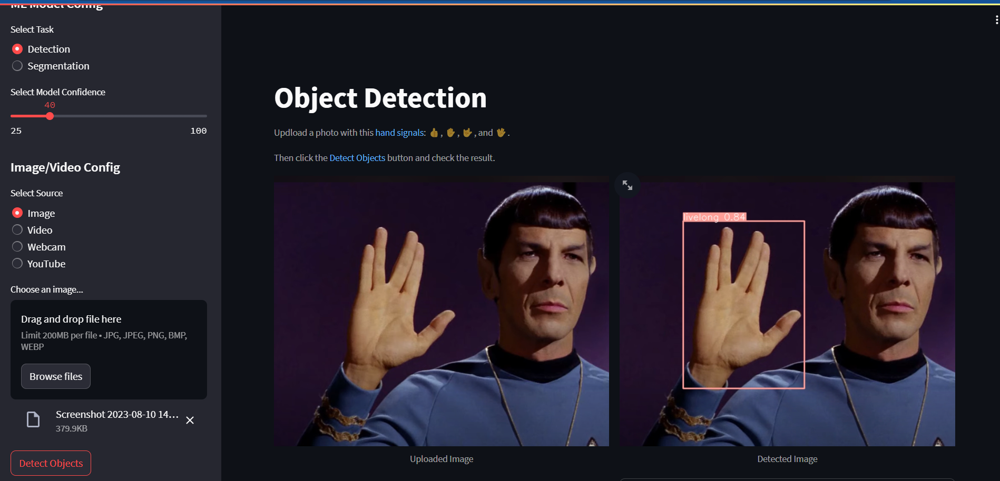
</p>

Based on the user’s selection of task and confidence level, the script selects either the detection or segmentation model and then proceeds to load the model.

<p align="center">
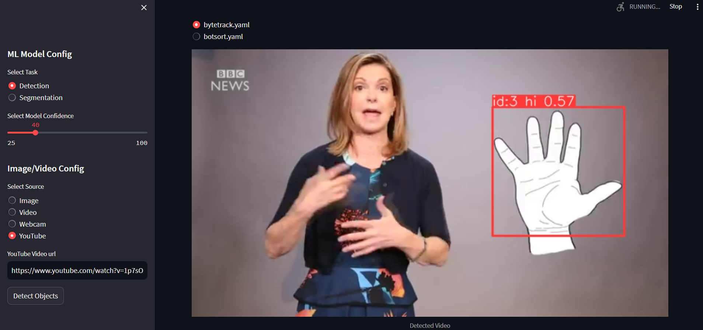
</p>

The streamlit interface and real-time detection make this application a valuable tool for various scenarios. When a media source is uploaded, the code uses the YOLOv8 model to predict and highlight objects. Detected bounding boxes are displayed, along with a plotted image. For video sources (stored, webcam, or YouTube), corresponding functions from the `helper` module are called to display the video feed with real-time object detection.

<p align="center">
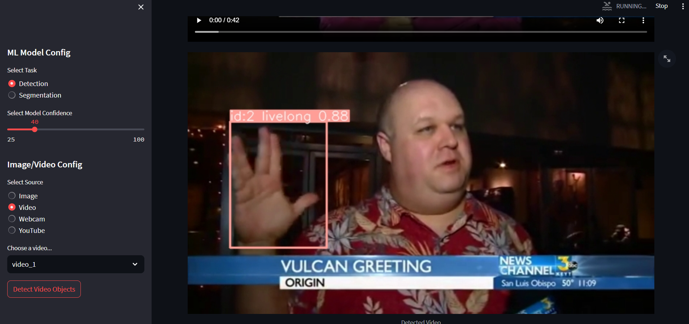
</p>

```
# Python In-built packages
from pathlib import Path
import PIL

# External packages
import streamlit as st

# Local Modules
import settings
import helper

# Setting page layout
st.set_page_config(
    page_title="Object Detection using YOLOv8",
    page_icon="🤖",
    layout="wide",
    initial_sidebar_state="expanded"
)

# Main page heading
st.title("Object Detection")
st.caption('Updload a photo with this :blue[hand signals]: :+1:, :hand:, :i_love_you_hand_sign:, and :spock-hand:.')
st.caption('Then click the :blue[Detect Objects] button and check the result.')

# Sidebar
st.sidebar.header("ML Model Config")

# Model Options
model_type = st.sidebar.radio(
    "Select Task", ['Detection', 'Segmentation'])

confidence = float(st.sidebar.slider(
    "Select Model Confidence", 25, 100, 40)) / 100

# Selecting Detection Or Segmentation
if model_type == 'Detection':
    model_path = Path(settings.DETECTION_MODEL)
elif model_type == 'Segmentation':
    model_path = Path(settings.SEGMENTATION_MODEL)

# Load Pre-trained ML Model
try:
    model = helper.load_model(model_path)
except Exception as ex:
    st.error(f"Unable to load model. Check the specified path: {model_path}")
    st.error(ex)

st.sidebar.header("Image/Video Config")
source_radio = st.sidebar.radio(
    "Select Source", settings.SOURCES_LIST)

source_img = None
# If image is selected
if source_radio == settings.IMAGE:
    source_img = st.sidebar.file_uploader(
        "Choose an image...", type=("jpg", "jpeg", "png", 'bmp', 'webp'))

    col1, col2 = st.columns(2)

    with col1:
        try:
            if source_img:
                uploaded_image = PIL.Image.open(source_img)
                st.image(source_img, caption="Uploaded Image",
                         use_column_width=True)
        except Exception as ex:
            st.error("Error occurred while opening the image.")
            st.error(ex)

    with col2:        
            if st.sidebar.button('Detect Objects'):
                res = model.predict(uploaded_image,
                                    conf=confidence
                                    )
                boxes = res[0].boxes
                res_plotted = res[0].plot()[:, :, ::-1]
                st.image(res_plotted, caption='Detected Image',
                         use_column_width=True)
                try:
                    with st.expander("Detection Results"):
                        for box in boxes:
                            st.write(box.data)
                except Exception as ex:
                    # st.write(ex)
                    st.write("No image is uploaded yet!")

elif source_radio == settings.VIDEO:
    helper.play_stored_video(confidence, model)

elif source_radio == settings.WEBCAM:
    helper.play_webcam(confidence, model)

elif source_radio == settings.YOUTUBE:
    helper.play_youtube_video(confidence, model)

else:
    st.error("Please select a valid source type!")

```

The helper.py file contains functions that are called from the app.py file. This file uses OpenCV and pytube (for YouTube video handling) libraries to read and process the video and Streamlit to display the video and detected objects.

The load_model() function initializes the YOLOv8 object detection model by loading it from the specified model path.

The display_tracker_options() function offers users the choice to enable object tracking. Users can select how to display tracking results and select a tracking algorithm (e.g., bytetrack.yaml or botsort.yaml). The _display_detected_frames() function displays video frames with detected objects. It resizes the image and calls the appropriate tracking or prediction methods based on user preferences.

The play_youtube_video() function enables users to input a YouTube video URL. It processes the video, performs real-time object detection, and displays the results on the web page. The play_webcam() function captures the webcam feed, processes frames, and displays real-time object detection and tracking results.

```
from ultralytics import YOLO
import streamlit as st
import cv2
from pytube import YouTube

import settings


def load_model(model_path):
    """
    Loads a YOLO object detection model from the specified model_path.

    Parameters:
        model_path (str): The path to the YOLO model file.

    Returns:
        A YOLO object detection model.
    """
    model = YOLO(model_path)
    return model


def display_tracker_options():
    display_tracker = st.radio("Display Tracker", ('Yes', 'No'))
    is_display_tracker = True if display_tracker == 'Yes' else False
    if is_display_tracker:
        tracker_type = st.radio("Tracker", ("bytetrack.yaml", "botsort.yaml"))
        return is_display_tracker, tracker_type
    return is_display_tracker, None


def _display_detected_frames(conf, model, st_frame, image, is_display_tracking=None, tracker=None):
    """
    Display the detected objects on a video frame using the YOLOv8 model.

    Args:
    - conf (float): Confidence threshold for object detection.
    - model (YoloV8): A YOLOv8 object detection model.
    - st_frame (Streamlit object): A Streamlit object to display the detected video.
    - image (numpy array): A numpy array representing the video frame.
    - is_display_tracking (bool): A flag indicating whether to display object tracking (default=None).

    Returns:
    None
    """

    # Resize the image to a standard size
    image = cv2.resize(image, (720, int(720*(9/16))))

    # Display object tracking, if specified
    if is_display_tracking:
        res = model.track(image, conf=conf, persist=True, tracker=tracker)
    else:
        # Predict the objects in the image using the YOLOv8 model
        res = model.predict(image, conf=conf)

    # # Plot the detected objects on the video frame
    res_plotted = res[0].plot()
    st_frame.image(res_plotted,
                   caption='Detected Video',
                   channels="BGR",
                   use_column_width=True
                   )


def play_youtube_video(conf, model):
    """
    Plays a webcam stream. Detects Objects in real-time using the YOLOv8 object detection model.

    Parameters:
        conf: Confidence of YOLOv8 model.
        model: An instance of the `YOLOv8` class containing the YOLOv8 model.

    Returns:
        None

    Raises:
        None
    """
    source_youtube = st.sidebar.text_input("YouTube Video url")

    is_display_tracker, tracker = display_tracker_options()

    if st.sidebar.button('Detect Objects'):
        try:
            yt = YouTube(source_youtube)
            stream = yt.streams.filter(file_extension="mp4", res=720).first()
            vid_cap = cv2.VideoCapture(stream.url)

            st_frame = st.empty()
            while (vid_cap.isOpened()):
                success, image = vid_cap.read()
                if success:
                    _display_detected_frames(conf,
                                             model,
                                             st_frame,
                                             image,
                                             is_display_tracker,
                                             tracker
                                             )
                else:
                    vid_cap.release()
                    break
        except Exception as e:
            st.sidebar.error("Error loading video: " + str(e))


def play_webcam(conf, model):
    """
    Plays a webcam stream. Detects Objects in real-time using the YOLOv8 object detection model.

    Parameters:
        conf: Confidence of YOLOv8 model.
        model: An instance of the `YOLOv8` class containing the YOLOv8 model.

    Returns:
        None

    Raises:
        None
    """
    source_webcam = settings.WEBCAM_PATH
    is_display_tracker, tracker = display_tracker_options()
    if st.sidebar.button('Detect Objects'):
        try:
            vid_cap = cv2.VideoCapture(source_webcam)
            st_frame = st.empty()
            while (vid_cap.isOpened()):
                success, image = vid_cap.read()
                if success:
                    _display_detected_frames(conf,
                                             model,
                                             st_frame,
                                             image,
                                             is_display_tracker,
                                             tracker,
                                             )
                else:
                    vid_cap.release()
                    break
        except Exception as e:
            st.sidebar.error("Error loading video: " + str(e))


def play_stored_video(conf, model):
    """
    Plays a stored video file. Tracks and detects objects in real-time using the YOLOv8 object detection model.

    Parameters:
        conf: Confidence of YOLOv8 model.
        model: An instance of the `YOLOv8` class containing the YOLOv8 model.

    Returns:
        None

    Raises:
        None
    """
    source_vid = st.sidebar.selectbox(
        "Choose a video...", settings.VIDEOS_DICT.keys())

    is_display_tracker, tracker = display_tracker_options()

    with open(settings.VIDEOS_DICT.get(source_vid), 'rb') as video_file:
        video_bytes = video_file.read()
    if video_bytes:
        st.video(video_bytes)

    if st.sidebar.button('Detect Video Objects'):
        try:
            vid_cap = cv2.VideoCapture(
                str(settings.VIDEOS_DICT.get(source_vid)))
            st_frame = st.empty()
            while (vid_cap.isOpened()):
                success, image = vid_cap.read()
                if success:
                    _display_detected_frames(conf,
                                             model,
                                             st_frame,
                                             image,
                                             is_display_tracker,
                                             tracker
                                             )
                else:
                    vid_cap.release()
                    break
        except Exception as e:
            st.sidebar.error("Error loading video: " + str(e))

```
One last thing from the previous images above, you can see the unique identifiers of the detected objects, in this case, hands. These IDs are assigned by the object detection model to each detected object. This allows the model to keep track of the same object across multiple frames of the video or image sequence, which is useful for applications like object tracking. The IDs can also be used to label and annotate the detected objects for further analysis or processing.

In the options if you choose No Tracking, the image below you can see our application is no longer displaying the object IDs.

<p align="center">
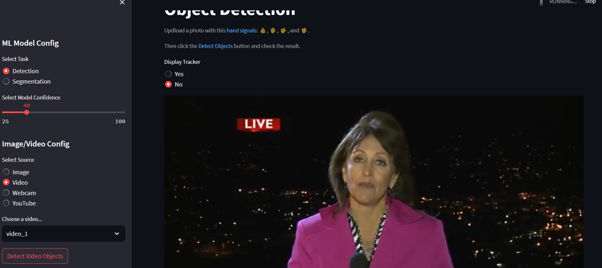
</p>

If you select the video source as YouTube, you can paste the URL of the YouTube video in the text box provided below. On pressing the ‘Detect Objects’ button, you will be able to view the frames of the video along with the detected objects, based on the options selected is slow but it works fine (I’ll do my research to optimize speed).

<p align="center">
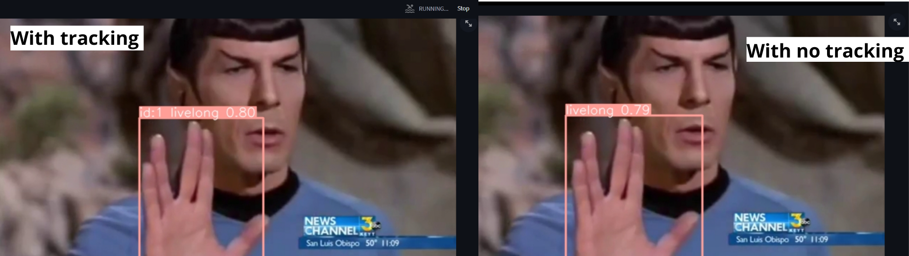
</p>

## part5 missing How to deploy the app in Streamlit Cloud


## Enhancing Active Learning: Uploading Data to Roboflow from Windows or Google Colab using the API 

Active learning aims to select the most informative samples from a large pool of unlabeled data to be labeled by usually a human annotator to improve the model’s performance.

In the context of Windows, active learning in this project will be collecting data and uploading this new data in Roboflow to increase model performance. It can be particularly useful when working with small datasets, which is common to improve models.

To Achieve this I’ll use Roboflow API to upload images to our existing dataset on the Roboflow platform. You can upload images to Roboflow projects using the web interface, Python SDK, REST API, and CLI.

First we have to have create our Notebook in Google Colab or create a Virtual envioroment in Conda or venv. If you are using Windows check this first. If you are using Colab jump this step. and go to the code.

```
python -m venv env
env\Scripts\activate
```

Then we can install notebook to open the notebooks.

```
pip install notebook
```
To set up our noteook we have to run the next commands:
```
import os
HOME = os.getcwd()
print(HOME)
```
```
!pip install ultralytics==8.0.20

from IPython import display
display.clear_output()

import ultralytics
ultralytics.checks()

from ultralytics import YOLO

from IPython.display import display, Image
```
```
!mkdir {HOME}/datasets
%cd {HOME}/datasets

!pip install roboflow --quiet
```

After this our notebook is ready to run the scrip. Before diving in to the code I need to remember that we need new data to upload. So make sure you have run the code from [Project Setup: Installing Dependencies and Creating Required Files and Directories](#project-setup-installing-dependencies-and-creating-required-files-and-directories) to get new data.

After that we now have a new data set that now we can upload our data to Roboflow using the API.

### Upload images to Roboflow using the API and Python.

First we need to check if we run the pip install roboflow. Then we need to run in the terminal. If we had success installing the library, create a new cell add the code below and click Run with the next code to ulpload the images in the folder you create recently (Just change the corresponding values of your project). The next code is to just upload one image and test:

```
from roboflow import Roboflow

# Initialize the Roboflow object with your API key
rf = Roboflow(api_key="xxxxxxxxxxxxxxxxxxxx")

# Retrieve your current workspace and project name
print(rf.workspace())

# Specify the project for upload
project = rf.workspace("xxxxxxxxxx").project("xxxxxxxx")

# Upload the image to your project
project.upload("/content/two.jpg")

```
To upload a entire folder use the next code:

```
import os
from roboflow import Roboflow

# Initialize the Roboflow object with your API key
rf = Roboflow(api_key="xxxxxxxxxxxxxxxxxxxx")

# Retrieve your current workspace and project name
print(rf.workspace())

# Specify the project for upload
project = rf.workspace("xxxxxxxxs").project("xxxxxxxxx")

# Folder path containing all the images
folder_path = "/content/images"  # Update this to your folder path

# Get a list of all image files in the folder
image_files = [os.path.join(folder_path, file) for file in os.listdir(folder_path) if file.lower().endswith(('.jpg', '.jpeg', '.png'))]

# Upload each image to your project
for image_file in image_files:
    project.upload(image_file)

```
In the Shell will appear all the information and if is running add some print to warning you when it’s over. When is running you will see that it takes a while, but the images will be uploaded.

<p align="center">
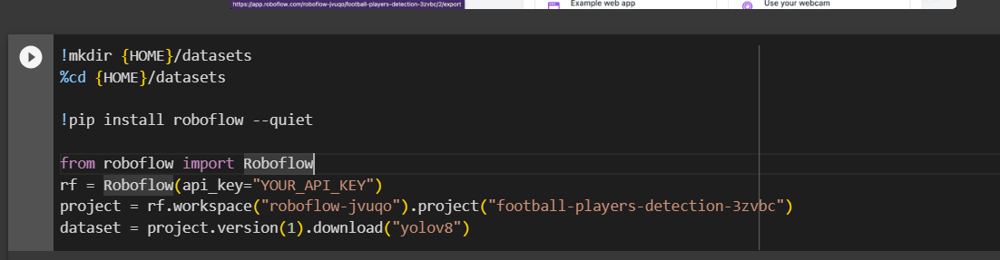
</p>

After it finishes you can wait a few minutes to see the images in the assign section from your Rboflow project as we see in the image below.

<p align="center">

</p>

Now we have a new data set of images to label manually and then retrain your model! By harnessing the potential of Active Learning with Windows or Google Colab and Roboflow API, you’ve created a streamlined process for capturing images and utilizing the Roboflow label them seamlessly. So, time to go ahead, dive into the labeling process, and let the possibilities of Active Learning and Roboflow API propel your machine learning journey forward.

## Enhancing Active Learning: Uploading Data to Roboflow from Raspberry Pi using the API

In the context of Raspberry Pi, active learning in this project will be collecting data and uploading this new data in Roboflow to increase model performance. It can be particularly useful when working with small datasets, which is common in embedded systems like the Raspberry Pi, where storage and computational resources may be limited.

To Achieve this I’ll use Roboflow API to upload images to our existing dataset on the Roboflow platform. You can upload images to Roboflow projects using the web interface, Python SDK, REST API, and CLI.

First we have to have set up our Raspberry Pi check my tutorial post [how to set up a Raspberry Pi](https://medium.com/geekculture/setting-up-your-raspberry-pi-4-wireless-f51c16937d1e). To collect data I’m using Buster version of Raspberry Pi OS, then we have to set up the camera, if you are using an official camera from Raspberry Pi check my tutorial [how to set up the camera with the OS version](https://medium.com/geekculture/camera-setup-on-raspberry-pi-4-912e7d415cdf) that I mentioned.

Once we have everything ready the first thing we need is create a Python code to automate as we did in Windows how to take photos, the code will create a folder with the name of the labels list we want, and for each folder will captures images with the camera the times we asked and as we did in Windows will appear a windows showing us what the camera see, let’s see the code:

```
import time
import picamera
from PIL import Image
import os

def get_image_size(image_path):
    with Image.open(image_path) as img:
        return img.size

def take_pictures(label, num_pictures, interval_seconds, output_folder):
    folder_path = os.path.join(output_folder, label)
    if not os.path.exists(folder_path):
        os.makedirs(folder_path)

    with picamera.PiCamera() as camera:
        # Start the preview
        camera.start_preview()

        for i in range(1, num_pictures + 1):
            # Generate the file name for the picture
            file_name = os.path.join(folder_path, f"{label}_picture{i}.jpg")

            # Capture the picture
            camera.capture(file_name)

            # Get the size of the captured image
            image_size = get_image_size(file_name)
            print(f"{label} - Picture {i}: Width={image_size[0]}, Height={image_size[1]}")

            # Wait for the specified interval before taking the next picture
            time.sleep(interval_seconds)

        # Stop the preview after capturing all pictures
        camera.stop_preview()

if __name__ == "__main__":
    labels = ["label1", "label2", "label3"]  # Add more labels if needed
    num_pictures_per_label = 20
    interval_seconds = 2
    label_delay_seconds = 10  # Delay between capturing pictures for each label
    output_folder = "my_pictures"  # Change this to the desired output folder name

    # Create the output folder if it doesn't exist
    if not os.path.exists(output_folder):
        os.makedirs(output_folder)

    for label in labels:
        print(f"Taking pictures for label: {label}")
        take_pictures(label, num_pictures_per_label, interval_seconds, output_folder)
        time.sleep(label_delay_seconds)
```
This is how will look like:

<p align="center">
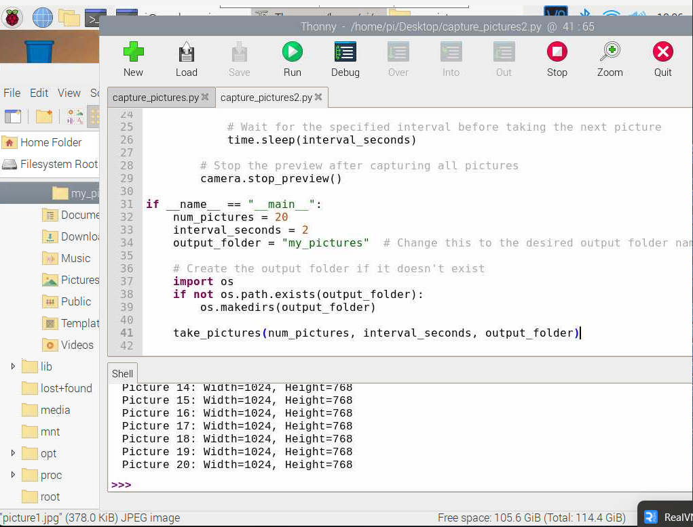
</p>

After that we now have a new data set that now we can upload our data to Roboflow. Now i’ll talk about the problem with the Raspberry Pi OS. What I tried is installing Roboflow in the Buster version and it didn’t work, it looks like there is no compatible version. Because of that now we need to setup the Raspberry with the latest version of Raspberry Pi OS Bullseye, the problem with Bullseye is that it has a new camera library named picamera2 so this new library is a little bit tricky and the OS also it doesn’t allow you to access the camera easy as in the buster version so is necessary to go to the terminal and activate it manually. To access to this configuration we need to type sudo raspi-config. Warning this doesn’t work with VNC you need a monitor connected to the Pi.

<p align="center">
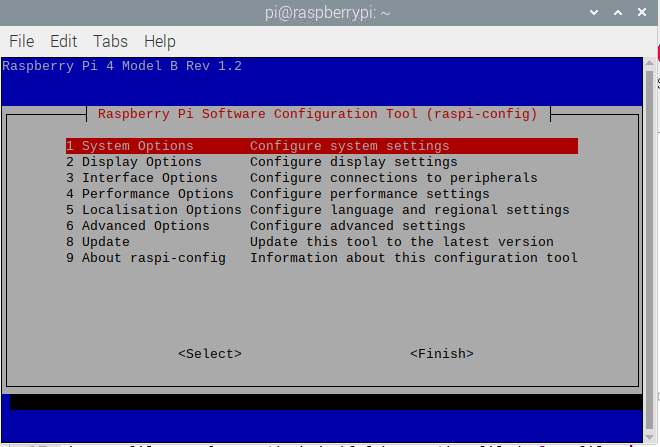
</p>

Select the option 3 Interface Options. And will appear:

<p align="center">
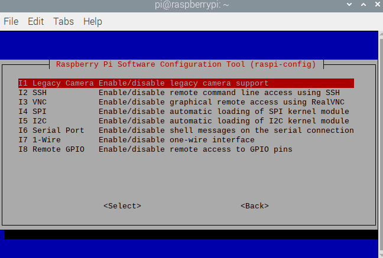
</p>

Then select I1 Legaby Camera enable and then Enable after this will ask you about rebooting and to have the changes made is necessary to reboot it. Then is possible to run the code is really similar to the one in Buster.

```
import time
from picamera2 import Picamera2, Preview
from PIL import Image
import os

picam2 = Picamera2()

def take_pictures(label, num_pictures, interval_seconds, output_folder):
    folder_path = os.path.join(output_folder, label)
    if not os.path.exists(folder_path):
        os.makedirs(folder_path)

    with picam2 as camera:
        # Start the preview
        camera.start(show_preview=True)

        for i in range(1, num_pictures + 1):
            # Generate the file name for the picture
            file_name = os.path.join(folder_path, f"{label}_picture{i}.jpg")

            # Capture the picture
            camera.capture_file(file_name)

            # Wait for the specified interval before taking the next picture
            time.sleep(interval_seconds)

        # Stop the preview after capturing all pictures
        camera.stop_preview()

if __name__ == "__main__":
    labels = ["label1", "label2", "label3"]  # Add more labels if needed
    num_pictures_per_label = 20
    interval_seconds = 2
    label_delay_seconds = 10  # Delay between capturing pictures for each label
    output_folder = "my_pictures"  # Change this to the desired output folder name

    # Create the output folder if it doesn't exist
    if not os.path.exists(output_folder):
        os.makedirs(output_folder)

    for label in labels:
        print(f"Taking pictures for label: {label}")
        take_pictures(label, num_pictures_per_label, interval_seconds, output_folder)
        time.sleep(label_delay_seconds)
```

Now after running any of the two previous codes to collect data let’s check how to upload this data from Raspberry Pi to Roboflow using the API.

### Upload images to Roboflow using the API and Python (Thonny IDE in Raspberry Pi).
First we need to have our Raspberry with the Bullseye version check my tutorial to setup the Raspberry[Setting up your Raspberry Pi 4 wireless (2023)](https://medium.com/geekculture/setting-up-your-raspberry-pi-4-wireless-cd3e70a53e3b). Then we need to run in the terminal

```
pip install roboflow
```

If we had success installing the library, open Thonny the Python IDE from Raspberry and click Run with the next code to ulpload the images in the folder you create recently (Just change the corresponding values of your project).

```
import os
from roboflow import Roboflow

# Initialize the Roboflow object with your API key
rf = Roboflow(api_key="xxxxxxxxxxxxxxxxx")

# Retrieve your current workspace and project name
print(rf.workspace())

# Specify the project for upload
project = rf.workspace("xxxxxxxx").project("xxxxxxxxx")

# Folder path containing all the images
folder_path = "/content/images"  # Update this to your folder path

# Get a list of all image files in the folder
image_files = [os.path.join(folder_path, file) for file in os.listdir(folder_path) if file.lower().endswith(('.jpg', '.jpeg', '.png'))]

# Upload each image to your project
for image_file in image_files:
    project.upload(image_file)
```

In the Shell will appear all the information and if is running add some print to warning you when it’s over. When is running you will see that it takes a while, but the images will be uploaded.

<p align="center">
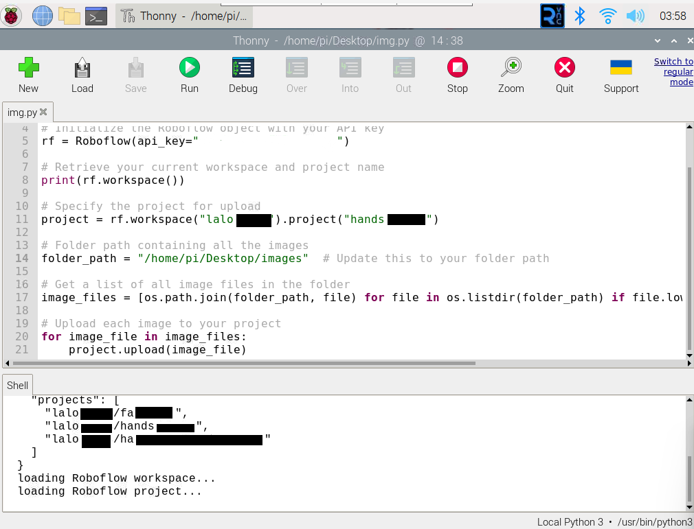
</p>

After it finishes you can wait a few minutes to see the images in the assign section from your Rboflow project as we see in the image below.

<p align="center">

</p>

Now we have a new data set of images to label manually and then retrain your model! By harnessing the potential of Active Learning with Raspberry Pi and Roboflow API, you’ve created a streamlined process for capturing images and utilizing the Roboflow label them seamlessly. So, go ahead, dive into the labeling process, and let the possibilities of Active Learning with Raspberry Pi and Roboflow API propel your machine learning journey.

## How to Deploy a Roboflow (YOLOv8) Model to a Raspberry Pi

To follow along with this tutorial, you will need a Raspberry Pi 4. You will need to run the 64-bit Raspberry Pi OS (Bullseye version) operating system.

The Raspberry Pi is a useful edge deployment device for many computer vision applications and use cases. For applications that operate at lower frame rates, from motion-triggered security systems to wildlife surveying, a Pi is an excellent choice for a device on which to deploy your application. Pis are small and you can deploy a state-of-the-art YOLOv8 computer vision model on your Pi.

Notably, you can run models on a Pi without an internet connection while still executing logic on your model inference results.

In this guide, we’re going to walk through how to deploy a computer vision model to a Raspberry Pi. We’ll be deploying a model built on Roboflow that we will deploy to a local Docker container. By the end of the guide, we’ll have a working computer vision model ready to use on our Pi.

Without further ado, let’s get started!

We are going to take where we finish in [Deploy model on Roboflow](#deploy-model-on-roboflow) from this repo where we have successfully trained our model. When the aforementioned deploy() function in your code, the weights were uploaded to Roboflow and the model was deployed, ready for use.

This guide is to run the model using image files that we have saved locally.

If your are going to take images check * [Enhancing Active Learning: Uploading Data to Roboflow from Raspberry Pi using the API](#enhancing-active-learning-uploading-data-to-roboflow-from-raspberry-pi-using-the-api) from this repo to see how use the camera in Raspberry Pi.


### Download the Roboflow Docker Container to the Pi
While we wait for our model to train, we can get things set up on our Raspberry Pi. To run our model on the Pi, we’re going to use the Roboflow inference server Docker container. This container contains a service that you can use to deploy your model on your Pi.

To use the model we built on a Pi, we’ll first install Docker:

```
curl -fsSL https://get.docker.com -o get-docker.sh
sudo sh get-docker.sh
```

After Docker is installed, we can pull the inference server Docker container that we will use to deploy our model:

```
sudo docker pull roboflow/inference-server:cpu

```
The inference API is available as a Docker container optimized and configured for the Raspberry Pi. You can install and run the inference server using the following command:

```
sudo docker run -it --rm -p 9001:9001 roboflow/roboflow-inference-server-arm-cpu
```
ou can now use your Pi as a drop-in replacement for the Hosted Inference API (see those docs for example code snippets in several programming languages).

Next, install the Roboflow python package with pip install roboflow.

### Run Inference
To run inference on your model, run the following code, substituting your API key, workspace and project IDs, project version, and image name as relevant. You can learn how to find your API key in our API docs and how to find your workspace and project ID.


```
from roboflow import Roboflow

rf = Roboflow(api_key="xxxxxxxxxxxxxxxxxxxx")
project = rf.workspace().project("xxxxxxxx")
model = project.version(1).model

model.predict("your_image.jpg", confidence=40, overlap=30).save("prediction.jpg")

prediction = model.predict("example.jpg")
print(prediction.json())

prediction.save("output.png")
```

This code tells our Python package that you want to run inference using a local server rather than the Roboflow API. The first time you run this code, you will need to have an internet connection. This is because the Python package will need to download your model for use in the inference server Docker container.

After your model has been downloaded once, you can run the program as many times as you like without an internet connection.

Now, let’s make a prediction on an image!

We can retrieve a prediction from our model that shows hand is in this image with a blue rectangle like a labeled image, when we run the code, we see a JSON dictionary that contains the coordinates of the hand in our image.

<p align="center">
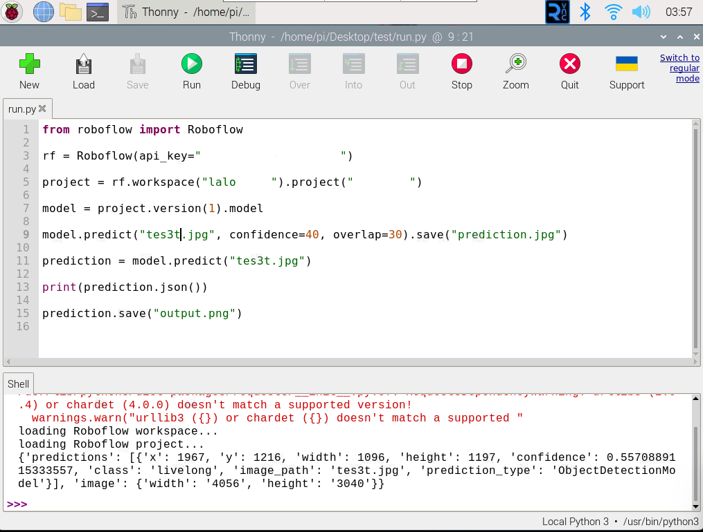
</p>

Our model is working! We can save an image that shows our annotated predictions, if we open up the file, we’ll see these results:

<p align="center">
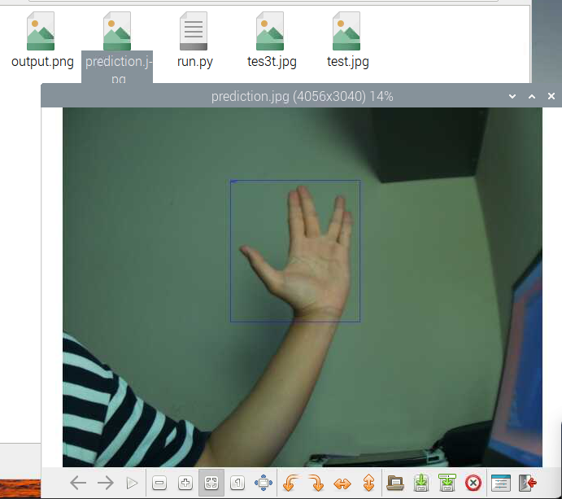
</p>

Right now, our model works using image files that we have saved locally. But, that doesn’t need to be the case. You could use the Roboflow Python package with a tool like the Raspberry Pi camera to take a photo every few seconds or minutes and retrieve predictions. Or you could use the Pi camera to run your model on a live video feed.

Conclusion
The Raspberry Pi is a small, versatile device on which you can deploy your computer vision models. With the Roboflow Docker container, you can use state-of-the-art YOLOv8 models on your Raspberry Pi.

Connected to a camera, you can use your Raspberry Pi as a fully-fledged edge inference device. Once you have downloaded your model to the device, an internet connection is not required, so you can use your Raspberry Pi wherever you have power.

Now you have the knowledge you need to start deploying models onto a Raspberry Pi. 

## How to Streamlit app in Raspberry Pi locally

Advantages of Running Locally
One such advantage is the seamless access to the Raspberry Pi’s built-in camera. By harnessing the potential of the local server, we gain the ability to interact with the camera module directly from our computer, opening up a realm of possibilities for remote surveillance, monitoring, and data collection. This proximity-based approach not only reduces latency but also offers greater control over the application’s performance, ensuring a smoother and more responsive user experience.

In the following sections, I will guide you through the step-by-step process of setting up the Raspberry Pi to run our Streamlit object detection app. So, let’s dive into the world of edge computing and uncover the potential that awaits when we bring AI closer to home.

Prerequisites
To follow this tutorial you’ll need a Raspberry Pi 4, a camera for it and all the other standard accessories.

Raspberry Pi 4 Model B 4GB or +
Raspberry Pi Camera Module
Heat sinks and Fan (optional but recommended)
5V 3A USB-C Power Supply
SD card (at least 8gb)
Raspberry Pi 4 Setup
PyTorch only provides pip packages for Arm 64bit (aarch64) so you’ll need to install a 64 bit version of the OS on your Raspberry Pi

You can download the version used in this guide arm64 Raspberry Pi OS from https://downloads.raspberrypi.org/raspios_arm64/images/ and install it via rpi-imager use this [tutorial](https://medium.com/@lalodatos/setting-up-your-raspberry-pi-4-wireless-2023-14a1229d374b) I create to install the specific version.

Note: For the moment I only tried with the version mentioned but I’ll do my test and update this post with the results using the latest versions. Also 32-bit Raspberry Pi OS will not work.

Once that boots and you complete the initial setup you’ll need to edit the `/boot/config.txt` file to enable the camera.

Use `cd ..` in the comand line to change folder until you found the boot folder and use `sudo nano config.txt` to be able to modify this file.


## Challenges I ran into and What I learned

One of the main challenges was to label with labelimg I didn't found a way to install it using Conda in Windows also the same in a virtual environment. After doing research I found how to download it in binary. 

The second main challenge was to run the Streamlit app in the Share hub, I have problems with the Pytorch version. The one I installed on my computer was not compatible with the platform and then it was missing the packages.txt. 

Finally, this is the first time I use Roboflow and Streamlit. In the end, I learned that whenever you may think that you found no way out, the motivation may help you to find alternative solutions with these resources.

## Observations about the project

The Share Streamlit Hub has only 1GB of memory to run apps so I need to be careful with what I deploy and also I try to run it in Heroku but it only gives me 500MB of memory so I couldn't run the app in Heroku. The images data set is hard to create because it is necessary to have images different from each other but with a webcam it is hard to get a variety of hands position. Also if hands position are similar can confuse some things. For this I would like to try PoseNet or MediaPipe to compare both.

Capturing images with the hands position could be hard doing more than 20 photos of a hand gesture. 

## Accomplishments that I'm proud of

- Building a custom script to capture images and just change a few variables for each project
- Create a images data set
- Have a model with an accuracy of >90 %
- Learning new technologies in a record time
- Create a Live demo using Streamlit
- Start creating a tool that will help others

## What's next for Hands Spelling Recognition with Object detection

- Develop a hand posture reconcnition model with PoseNet and/or Mediapipe
- Upload images and annotations from AWS or GCP or Azure to Roboflow.
- Deploy Model in Raspberry Pi.
- Upload images from Raspberry Pi
- Add web cam and video object detection

## License


<!-- CONTACT -->
## Contact

Eduardo Padron - [LinkedIn: @padrondata](https://www.linkedin.com/in/padrondata/)