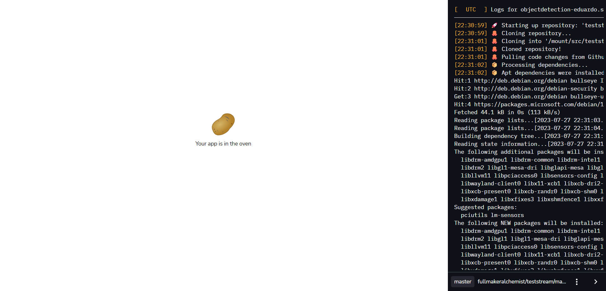

<!--
*** Thanks for checking out this README Template. If you have a suggestion that would
*** make this better, please fork the tinyml-mapping-backlight and create a pull request or simply open
*** an issue with the tag "suggest".
*** Thanks again! Now go create something AMAZING! :D
***
***
***
*** To avoid retyping too much info. Do a search and replace for the following:
*** fullmakeralchemist, tinyml-mapping-backlight, twitter_handle
-->

<!--#     The TensorFlow Microcontroller Challenge    -->
   <h1>Hands Spelling Recognition with Object Detection</h1>

<!-- PROJECT LOGO -->
<!--
<br />
<p align="center">
  <a href="https://github.com/fullmakeralchemist/tinyml-mapping-backlight">
    
  </a>
  <br />
  -->

  
  
  
  
  <a href="https://www.linkedin.com/in/padrondata/">
    
  </a>
  <!--
  <a href="https://twitter.com/makeralchemist/">
    
  </a>
  -->
  <!--
   <h3 align="center">Tiny ML in Mapping Dance, Visual Arts and interactive museums</h3>
  <p align="center">
    Because Art Inspired Technology, Technology Inspired Art
    <br />
    <a href="https://experiments.withgoogle.com/mapping-dance"><strong>View the project»</strong></a>
    <br />
  </p>
  <p align="center">
  <a href="https://experiments.withgoogle.com/mapping-dance">
    
  </a>
  </p>
  <br />
</p>
<br />
-->

<!-- TABLE OF CONTENTS -->
## Table of Contents

* [About the Project](#about-the-project)
  * [Motivation](#motivation)
  * [Built With](#built-with)
* [Getting Started](#getting-started)
  * [Prerequisites](#prerequisites)
  * [Installation](#installation)
* [Part 1: Introduction and Setup for Roboflow](#part-1-introduction-and-setup-for-roboflow)
  * [Demo of the Object Detection App](#demo-of-the-object-detection-app)
  * [Object Detection](#object-detection)
  * [What is YOLOv8?](#what-is-yolov8)
  * [Why Should I Use YOLOv8?](#why-should-i-use-yolov8)
  * [Why Streamlit is a Good Choice for Building a ML App](#why-streamlit-is-a-good-choice-for-building-a-ml-app)
  * [Project Setup: Installing Dependencies and Creating Required Files and Directories](#project-setup-installing-dependencies-and-creating-required-files-and-directories)
  * [Creating Virtual Environment](#creating-virtual-environment)
  * [Create a project with Roboflow](#create-a-project-with-roboflow)
  * [Upload your images](#upload-your-images)
* [Train YOLOv8 on a custom dataset](#train-yolov8-on-a-custom-dataset)
  * [Deploy model on Roboflow](#deploy-model-on-roboflow)
* [Creating a Streamlit WebApp for Image Object Detection with a Roboflow model](#creating-a-streamlit-webapp-for-image-object-detection-with-a-roboflow-model)
  * [Create a Uploading an Image On Streamlit WebApp](#create-a-uploading-an-image-on-streamlit-webapp)
* [Challenges I ran into and What I learned](#challenges-i-ran-into-and-what-i-learned)
* [Observations about the project](#observations-about-the-project)
* [Accomplishments that I'm proud of](#accomplishments-that-im-proud-of)
* [What's next Hands Spelling Recognition with Object detection](##whats-next-for-tiny-ml-in-mapping-dance-visual-arts-and-interactive-museums)
* [License](#license)
* [Contact](#contact)

<!-- ABOUT THE PROJECT -->
## About The Project

<!-- [](https://www.youtube.com/watch?v=3YUVTDTo-Zk) -->

The goal of this project is to detect and translate Sign Language (ASL) fingerspelling into text. You will create a model trained on the images dataset, custom created specifically to try different approaches. This may help move sign language recognition forward, making AI more accessible for the Deaf and Hard of Hearing community.

This project makes use of a machine learning platform that simplifies the process capable of identifying associated gesture recognition through images. This allows the user to work with it on custom needs.

### Motivation

Some facts:

Voice-enabled assistants open the world of useful and sometimes life-changing features of modern devices. These revolutionary AI solutions include automated speech recognition (ASR) and machine translation. **Unfortunately, these technologies are often not accessible to the more than 70 million Deaf people around the world who use sign language to communicate, nor to the 1.5+ billion people affected by hearing loss globally.**

##### Technology can be an element for good, but only when everyone is included.

But sign language recognition AI for text entry lags far behind voice-to-text or even gesture-based typing, as robust datasets didn't previously exist.

Technology that understands sign language fits squarely with AI solutions and makes it universally accessible and useful. AI principles also support this idea and encourage projects that empower people, widely benefit current and future generations, and work for the common good. This project can be scaled, and support individual user experience needs while interacting with technology.

### Built With

With a lot of love 💖, motivation to help others 💪🏼 and [Python](https://www.python.org/) 🐍, using:

* [Roboflow](https://app.roboflow.com/)
* [Google Colab](https://colab.research.google.com/)  (with its wonderful GPUs)
* Laptop with webcam
* [Streamlit](https://streamlit.io/)


<!-- GETTING STARTED -->
## Getting Started

Object detection is a groundbreaking computer vision task that has a ton of applications across various industries. It goes beyond traditional image classification, where a model assigns a single label to an entire image, to identify and locate multiple objects within an image, often accompanied by bounding boxes outlining their positions.

When working on custom models for object detection or other machine learning tasks, one of the challenges that researchers and developers may encounter is the lack of suitable databases or datasets. Overcoming these challenges often requires creativity and resourcefulness so this post will focus on how to create your custom database.

<p align="center">

</p>

## Prerequisites

This is short list things you need to use the guide. 

* Python
* Git

## Part 1: Introduction and Setup for Roboflow
Welcome to Part 1 of our three-part tutorial series on Building Your Own Real-Time Object Detection App: Roboflow(YOLOv8) and Streamlit. In this series, we will walk you through the process of building an end-to-end object detection app that can identify objects from a photo. This web app was built only for images because we are using [share.streamlit.io](http://share.streamlit.io/) this is the Streamlit project hub where you can post your Streamlit projects free and it has a limit of 1 GB memory space for the app, there is a few libraries that cover a lot of that space so in another post or series I’ll add more about video and webcam functions to complement this app.

In Part 1, we will introduce the project, give you a demo of the app in action, and explain why I chose Roboflow and Streamlit for this project. We will also guide you through the setup process, including installing dependencies and creating the necessary files and directories.

By the end of this series, you will have the skills to build your own object detection app. So, let’s dive in!

### Demo of the Object Detection App
This is the [web app](https://objectdetection-eduardo.streamlit.app/) demo from the project that we are going to create and build together in the Streamlit share cloud. The app Object Detection will Upload an image on the WebApp and show detected objects.

### Object Detection
Object detection is a computer vision solution that identifies instances of objects in visual media. Object detection scripts draw a bounding box around an instance of a detected object, paired with a label to represent the contents of the box. For example, a person in an image might be labeled “person” and a car might be labeled “vehicle”.

### What is YOLOv8?
YOLOv8 is the newest state-of-the-art YOLO model that can be used for object detection, image classification, and instance segmentation tasks. YOLOv8 was developed by [Ultralytics](https://ultralytics.com/?ref=blog.roboflow.com), this model is used in Roboflow.

### Why Should I Use YOLOv8?
Here are a few main reasons why you should consider using YOLOv8 for your next computer vision project:

YOLOv8 has a high rate of accuracy measured by COCO and Roboflow 100.
YOLOv8 comes with a lot of developer-convenience features,an a well-structured Python package.
The labeling tool is easy to use and you don’t need to install a tool for that.
And last but not least is not difficult to run it also is faster than use a notebook with TensorFlow. In my case it takes 3 hours to train the model in Google Colab but with Roboflow it took me a few minutes.
### Why Streamlit is a Good Choice for Building a ML App
[Streamlit](https://docs.streamlit.io/) makes it easy to build web-based user interfaces for machine learning applications, enabling data scientists and developers to share their work with non-technical stakeholders.

Streamlit is an open-source framework that simplifies the process of building web applications in Python. And it has it’s own project cloud that makes really easy deploy your project.

### Project Setup: Installing Dependencies and Creating Required Files and Directories
Before diving into the project, make sure you have the following dependencies installed on your system. In my case I’m a Windows user so everything in this tutorial is working for July 2023 in Windows 11.

For this project I have Python 3.11 but in Streamlit cloud only has the version 3.8 to 3.11 so I recommend using that range of versions and the Python packages that we will use will be PyTorch, Ultralytics and Streamlit. We can install these packages using pip into a separate virtual environment.

### Creating Virtual Environment
When working on a Python project, it’s important to keep your dependencies separate from your global Python environment to prevent conflicts between different projects, especially with Pytorch.

Make sure you already have installed Python, VS code(or other IDE) and Git. Follow the next steps:

Create a new virtual environment by running the following command in the terminal after venv you can name as you wish your environment:
```
python -m venv env
```
Then activate the enviroment:
```
env\Scripts\activate
```
The first step is getting our data set (Images folder). In this case I recommend having at least 200 images. While the more pictures you have, the better your model becomes but don’t use pictures nearly identicals. I’m using 4 different sign hand posture so taking 50 photos with any device can take a lot of time so let’s create an environment only for the script that will take photos with our web cam. In this environment we only need to install OpenCV. So run in your terminal:

```
pip install opencv-python
```
Now you can run the following script, basically you can modify the labels, these labels will be used to create folders and will take the number of images that you declared. After finishing with the first label it will continue with the next one until it finishes the labels list. And will display a window that shows what is capturing. Also you can modify the time between each shot and time between the labels capture. Start taking pictures:

```
link codigo
```
At this point we will have the amount of images that we need but the name of each picture is random so we have to rename it to make it easier to identify each image. The next code will rename each image in just one folder so run the code for each folder in your project.

link codigo

### Create a project with Roboflow
Building a custom dataset can be a painful process. It might take dozens or even hundreds of hours to collect images, label them, and export them in the proper format. Fortunately, Roboflow makes this process straightforward. If you only have images, you can label them in [Roboflow Annotate](https://docs.roboflow.com/annotate?ref=blog.roboflow.com). (When starting from scratch, consider [annotating large batches of images via API](https://docs.roboflow.com/annotate/annotate-api?ref=blog.roboflow.com) or use the [model-assisted labeling](https://blog.roboflow.com/announcing-label-assist/) tool to speed things up.)

Before you start, you need to create a Roboflow [account](https://app.roboflow.com/login?ref=blog.roboflow.com). Once you do that, you can create a new project in the Roboflow dashboard.

<p align="center">

</p>

Keep in mind to choose the right project type. In this case choose, Object Detection.

<p align="center">

</p>

### Upload your images
Add data to your newly created project. You can do it through the [web interface](https://docs.roboflow.com/adding-data/object-detection?ref=blog.roboflow.com). If you don’t have a dataset, you can grab one from [Roboflow Universe](https://universe.roboflow.com/?ref=blog.roboflow.com).

If you drag and drop a directory with a data set in a supported format, the Roboflow dashboard will automatically read the images and annotations together. To create a data set with annotations locally in Windows check [this post](https://medium.com/@lalodatos/label-your-images-with-labelimg-in-windows-for-object-detection-models-1b0a66f00a7b).

<p align="center">

</p>

<p align="center">

</p>

After all images uploaded you can click Save and Continue.

<p align="center">

</p>

Then it will appear the pop-up window and you can Click only in Assing Images, in this part if you are working with a Team you can invite them to add images or labeling.

<p align="center">

</p>
Then we need to click Start Annotating in case you upload images only to use the label tool from Roboflow.

<p align="center">

</p>

### Label your images
Use the tool to select the element with the classes that you are going to use in your model. And repeat the same process for all the images.

<p align="center">

</p>

After you finish labeling all the images click the back button highlighted in red in the image below.

<p align="center">

</p>

Now we can add all the images to the Dataset with the button Add n Image to the Dataset.

<p align="center">

</p>

Now will appear the option to Add Images you can choose different options I recommend using the default option.

<p align="center">

</p>

After loading our images to the database another window will appear. You need to make sure that there are no UNASSIGNED images and the Dataset is ready, once you have it similar as the image below you can Click Generate New Version.

<p align="center">

</p>

When we Generate a New Version we can use some tools to prepare the data and experiment with them. Go to option 3.

<p align="center">

</p>

In this option we can apply transformations in all the images, so make sure to configure this depending on your project. Maybe you are using a camera in Raspberry Pi or maybe you want to use images with a specific format. For my project this configuration is perfect.

<p align="center">

</p>

Option 4 is an amazing tool because you can generate extra versions from your images that can duplicate or triplicate in the free version of the dataset. Let’s see the options.

<p align="center">

</p>

For this project I’ll use flip horizontal, try to experiment with it, and depending on your project you can choose the options that you need.

<p align="center">

</p>

After you choose an Augmentation you will see extra options. For my project I only need the Horizontal. Try to check what is best for your custom project. After that click Apply

<p align="center">

</p>

Then click continue to step 5 and last.

<p align="center">

</p>

Select the Maximun Version and then click Generate and is ready to go.

<p align="center">

</p>

After this will appear the next page:

<p align="center">

</p>

Congratulations now you have an Image Dataset ready to train a model.

## Train YOLOv8 on a custom dataset
In this section, we will dive deeper into the YOLOv8 object detection model and explore how to train it .

There are a wide range of open-source object detection models available. A popular choice is models in the YOLO (You Only Look Once) family, which continue to represent the state-of-the-art in object detection tasks.

Once you have a labeled dataset, and you have made your augmentations, it is time to start training an object detection model. Training involves showing instances of your labeled data to a model in batches and iteratively improving the way the model is mapping images to predictions.

As with labeling, you can take two approaches to training and inferring with object detection models train and deploy yourself, or use training and inference services like Roboflow Train and Roboflow Deploy. Both of which are free for Public plans.

In [Upload your images](#label-your-images) we finished the Versions tool from our Roboflow project now is time to train the model. We have to choose the option Custom Train using YOLOv5 and then Get Snippet.

<p align="center">

</p>

A pop up copy the lines or save it we need the api_key to modify the notebook, will open a notebook in Google Colab after clicking Copy Snippet. Is a repository make sure to create a copy to save the changes first.

<p align="center">

</p>

When you open the notebook it is necessary to run all to set up the Colab session. There are a few cells that you can avoid but check it first.

<p align="center">

</p>

If we remember we have the api_key and extra information about our data set we will use it in the Step 5: Exporting dataset from the Notebook we will find a code cell and we need to replace with the copied lines from Roboflow after that we can run everything without modifying anything else.

<p align="center">

</p>


### Deploy model on Roboflow
Once you have finished training the YOLOv8 model, you’ll have a set of trained weights ready for use. These weights will be in the /runs/detect/train/weights/best.pt folder of your project. You need to download the filebest.pt to use it in the Streamlit app.

<p align="center">

</p>

<!-- USAGE EXAMPLES -->
## Creating a Streamlit WebApp for Image Object Detection with a Roboflow model
Streamlitis an open-source app framework for Machine Learning and Data Science teams. Create beautiful web apps in minutes. Streamlit apps are Python scripts that run from top to bottom. Every time a user opens a browser tab pointing to your app, the script is re-executed. As the script executes, Streamlit draws its output live in a browser.

[Create an app](https://docs.streamlit.io/library/get-started/create-an-app) using Streamlit’s core features to fetch and cache data, draw charts, plot information on a map, and use interactive widgets, like a slider, to filter results.

Let’s prepare the virtual environment for the Streamlit app. First let’s create a virtual environment and once created then activate it (Windows).

```
python -m venv env
env\Scripts\activate
```

Then we have to install PyTorch, Ultralytics and Streamlit. Try to install in the next order.

```
pip install torch
pip install ultralytics
pip install streamlit
```

After this we are ready to try the hello world in Streamlit to check that everything is installed correctly. Create a file called app.py and put the next code lines using your favorite IDE:

```
import streamlit as st
st.write("Hello, World!")
```

Then run it from the terminal in cmd and if everything works fine will open the browser.

```
streamlit run app.py
```

Then to create a tool to upload our pictures and use the model we need to open the code editor and let’s get started by replacing the previous file and creating a new one named app.py. But we also need a folder called weights and for the moment is everything. Now let’s go to the next step.

## Create a Uploading an Image On Streamlit WebApp
We’ll use Streamlit to allow users to upload an image. After successfully uploading an image, is ready to run object detection on the uploaded image using YOLOv8. This step involves loading the YOLOv8 model and passing the uploaded image through the model to identify the objects present in the image.

We will also visualize the output of the model with the identified objects highlighted in the image. Let’s go into the code.

In [Deploy model on Roboflow](#deploy-model-on-roboflow) of this series, we have discussed how to download a pre-trained weight file of the Yolov8 model. downloaded the best.pt file and saved it inside our weights directory. We will use the same weight file. In the created file with the name app.pywrite the following lines of code:

link codigo

You can modify the app text in the st.caption line codes as you prefer for your project now let’s run the app with in the terminal:

```
streamlit run app.py
```

This will deploy our app in the web browser that we are currently using, upload an image an check that identifies the objects:

<p align="center">

</p>

If everything run properly please run the next command to get the requirements:

```
pip freeze > requirements.txt
```

Also we need to create a file called packages.txt in the code folder that and put this line in it:

```
libgl1
```

Now we can create a repo in Github to put our app in the streamlit.io but before that make sure erase everything in the requierements except for 3 things:

```
torch==2.0.1
ultralytics==8.0.142
streamlit==1.25.0
```

The [Streamlit.io](https://share.streamlit.io/) only allows uploading 1GB. The installations use the most of the space, so to avoid that we leave the three mandatory libraries for our app. Check this repository the folder [Code]() and how it needs to uploaded.

<p align="center">

</p>

From here we are ready to go to [Streamlit.io](https://share.streamlit.io/) and deploy our app. Create an account and then will appear the next window click in the New app.

<p align="center">

</p>

Connect the Streamlit account with Github and then select the repository where your app is located. then select the branch and change the Main file path:

<p align="center">

</p>

Now select the Python version and save the changes after this we can click the deploy button.

<p align="center">

</p>

Then will appear the next window showing all the installations. Check if there are errors.

<p align="center">

</p>

Then you can try your app and check if it works properly.

<p align="center">

</p>

The combination of Roboflow and Streamlit enables the development of applications with a user-friendly interface. This approach makes it easier to detect and track objects in real time, allowing for a wide range of use cases not only for Object detection models for other data science and ML projects.

## Challenges I ran into and What I learned

One of the main challenges was to label with labelimg I didn't found a way to install it using Conda in Windows also the same in a virtual environment. After doing research I found how to download it in binary. 

The second main challenge was to run the Streamlit app in the Share hub, I have problems with the Pytorch version. The one I installed on my computer was not compatible with the platform and then it was missing the packages.txt. 

Finally, this is the first time I use Roboflow and Streamlit. In the end, I learned that whenever you may think that you found no way out, the motivation may help you to find alternative solutions with these resources.

## Observations about the project

The Share Streamlit Hub has only 1GB of memory to run apps so I need to be careful with what I deploy and also I try to run it in Heroku but it only gives me 500MB of memory so I couldn't run the app in Heroku. The images data set is hard to create because it is necessary to have images different from each other but with a webcam it is hard to get a variety of hands position. Also if hands position are similar can confuse some things. For this I would like to try PoseNet or MediaPipe to compare both.

Capturing images with the hands position could be hard doing more than 20 photos of a hand gesture. 

## Accomplishments that I'm proud of

- Building a custom script to capture images and just change a few variables for each project
- Create a images data set
- Have a model with an accuracy of >90 %
- Learning new technologies in a record time
- Create a Live demo using Streamlit
- Start creating a tool that will help others

## What's next Hands Spelling Recognition with Object detection

- Develop a hand posture reconcnition model with PoseNet and/or Mediapipe
- Upload images and annotations from AWS or GCP or Azure to Roboflow.
- Deploy Model in Raspberry Pi.
- Upload images from Raspberry Pi

## License


<!-- CONTACT -->
## Contact

Eduardo Padron - [LinkedIn: @padrondata](https://www.linkedin.com/in/padrondata/)